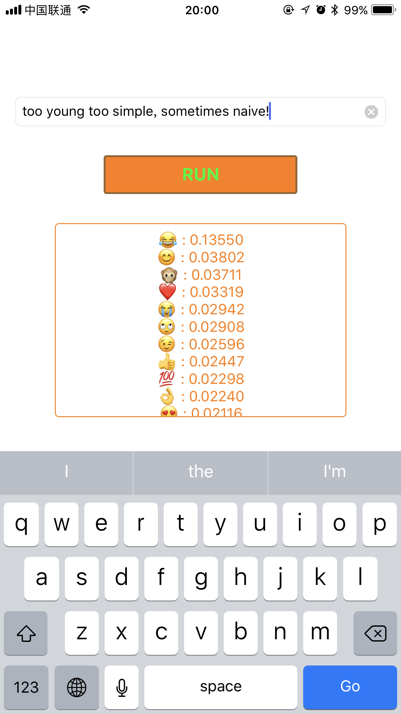
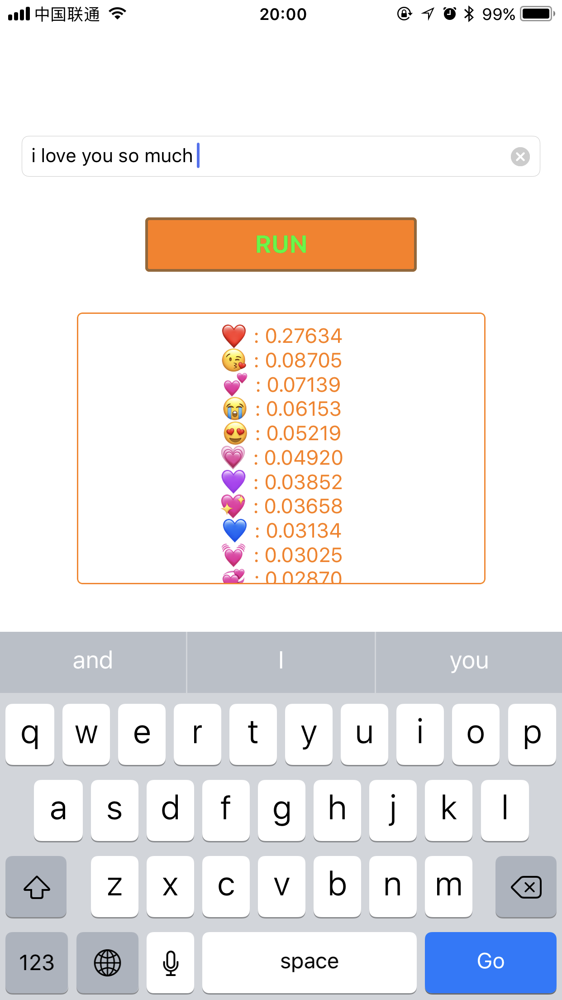

# LibTensorFlowForiOSSwift

[中文文档](./README_CN.md)

This is a TensorFlow demo that can be run on iOS and use swift develop. It implements a text classifier that can predict emoji from short text (like tweets).

<div style="text-align: center;">


</div>

changed by [`emoji-tf-ios`](https://github.com/h4x3rotab/emoji-tf-ios); use `emoji_frozen.pb` model from `emoji-tf-ios`.


### how to run

- open terminal and go to project root folder

- input `sh run.sh`. 

In the end, will automatically open Xcode 

you can run the project now

### about `run.sh`

it will compile the `TensorFlow for iOS` automatically

### about project setting 
> how to import TensorFlow in ios project


- download TensorFlow to the root folder and compile
	> befor compile source file, you should change flow TensorFlow Kernel files. (version <= 1.2.1)
	> 
	> in `run.sh`, it will change them automatically
	>
	> kernel path: `tensorflow/tensorflow/core/kernels`

	- `cwise_op_add_1.cc`
		> before:

		```c++
		...
		...
		#include "tensorflow/core/kernels/cwise_ops_common.h"

		namespace tensorflow {
		REGISTER5(BinaryOp, CPU, "Add", functor::add, float, Eigen::half, double, int32,
		          int64);

		#if TENSORFLOW_USE_SYCL
		...
		...
		```

		> change to:

		```c++
		...
		...
		#include "tensorflow/core/kernels/cwise_ops_common.h"

		namespace tensorflow {
		REGISTER5(BinaryOp, CPU, "Add", functor::add, float, Eigen::half, double, int32,
		          int64);

		// line 21 insert this code
		#if defined(__ANDROID_TYPES_SLIM__)
		REGISTER(BinaryOp, CPU, "Add", functor::add, int32);
		#endif  // __ANDROID_TYPES_SLIM__
		// insert end

		#if TENSORFLOW_USE_SYCL
		...
		...
		```

	- `cwise_op_less.cc`
		> before:

		```c++
		...
		...
		#include "tensorflow/core/kernels/cwise_ops_common.h"

		namespace tensorflow {
		REGISTER8(BinaryOp, CPU, "Less", functor::less, float, Eigen::half, double,
		          int32, int64, uint8, int8, int16);
		#if GOOGLE_CUDA
		REGISTER7(BinaryOp, GPU, "Less", functor::less, float, Eigen::half, double,
		          int64, uint8, int8, int16);
		...
		...
		```

		> change to:

		```c++
		...
		...
		#include "tensorflow/core/kernels/cwise_ops_common.h"

		namespace tensorflow {
		REGISTER8(BinaryOp, CPU, "Less", functor::less, float, Eigen::half, double,
		          int32, int64, uint8, int8, int16);
		
		// line 21 insert this code
		#if defined(__ANDROID_TYPES_SLIM__)
		REGISTER(BinaryOp, CPU, "Less", functor::less, int32);
		#endif  // __ANDROID_TYPES_SLIM__
		// insert end

		#if GOOGLE_CUDA
		REGISTER7(BinaryOp, GPU, "Less", functor::less, float, Eigen::half, double,
		          int64, uint8, int8, int16);
		...
		...
		```


- about `libtensorflow-core.a`
	- in `Other Link Flags` add `$(SRCROOT)/tensorflow/tensorflow/contrib/makefile/gen/lib/libtensorflow-core.a`
	- in `Library Search Paths` add `$(SRCROOT)/tensorflow/tensorflow/contrib/makefile/gen/lib`

- about `libprotobuf.a & libprotobuf-lite.a`
	- in `Build Phases | Link Binary With Libraries` add `libprotobuf.a & libprotobuf-lite.a` (path: `tensorflow/tensorflow/contrib/makefile/gen/protobuf_ios/lib/`)
	- in `Library Search Paths` add `$(SRCROOT)/tensorflow/tensorflow/contrib/makefile/gen/protobuf_ios/lib` 

- in `Header Search Paths` add flows
	- `$(SRCROOT)/tensorflow/`
	- `$(SRCROOT)/tensorflow/tensorflow/contrib/makefile/downloads/protobuf/src/`
	- `$(SRCROOT)/tensorflow/tensorflow/contrib/makefile/downloads`
	- `$(SRCROOT)/tensorflow/tensorflow/contrib/makefile/downloads/eigen`
	- `$(SRCROOT)/tensorflow/tensorflow/contrib/makefile/gen/proto`

- in `Other Link Flags` add `-force_load`

- in `Build Phases | Link Binary With Libraries` add `Accelerate.framework`

- in `C++ Language Dialect` select `GNU++11` or `GNU++14`

- in `C++ Standard Library` select `libc++`

- `Enable Bitcode` set `No`

- remove any `-all_load` ，use `-ObjC` replace it
	> Remove any use of the `-all_load` flag in your project. The protocol buffers libraries (full and lite versions) contain duplicate symbols, and the `-all_load` flag will cause these duplicates to become link errors. If you were using `-all_load` to avoid issues with Objective-C categories in static libraries, you may be able to replace it with the `-ObjC` flag.

- suppress TensorFlow warning：
	- in `Other C Flags` & `Other C++ Flags` add `-isystem $(SRCROOT)/tensorflow`


### reference:
- compile TensorFlow:
	> https://github.com/tensorflow/tensorflow/tree/master/tensorflow/contrib/makefile

- change Kernels error:
	> https://github.com/h4x3rotab/emoji-tf-ios/blob/master/README.md

- import TensorFlow to iOS:
	> https://github.com/tensorflow/tensorflow/blob/master/tensorflow/examples/ios/README.md

- suppress warning of TensorFlow:
	> https://clang.llvm.org/docs/UsersManual.html#id27
